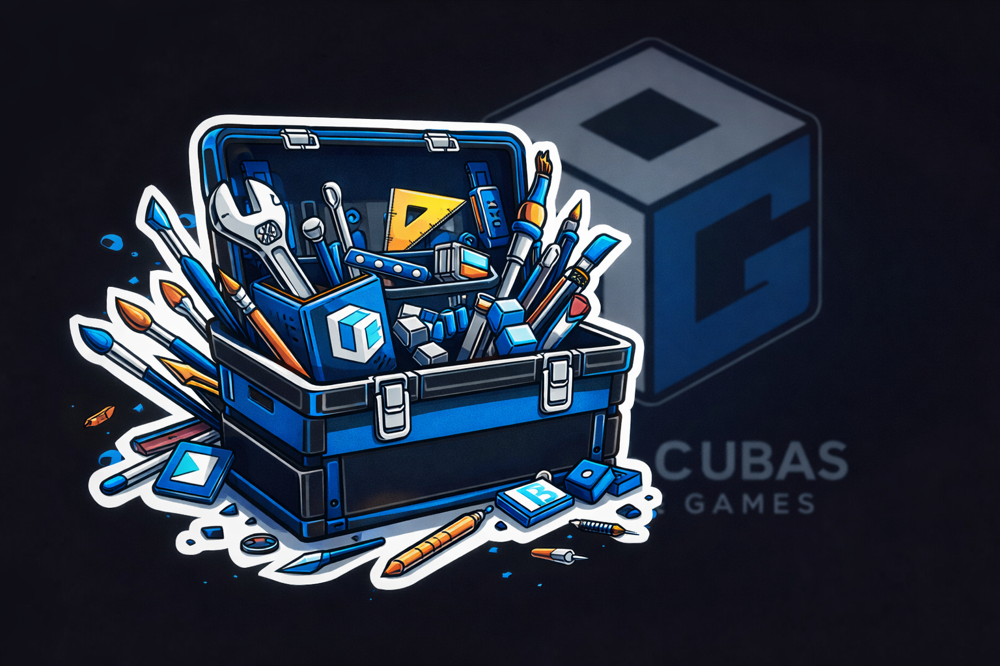

# CGTools — Unity Editor Extensions by Cubas Games



> A modular, open-source suite of Unity Editor extensions designed to boost your workflow — with zero runtime overhead.

---

## What is CGTools?

CGTools is a **modular framework** for Unity Editor tools. Instead of a monolithic plugin, CGTools works like a toolbox: install the core, then add only the modules you need.

Every module is:
- **Editor-only** — no impact on game performance or build size
- **Independent** — install and uninstall modules without breaking anything
- **Open source** — free forever, no strings attached

---

## Modules

| Module | Description | Status |
|--------|-------------|--------|
| 🎨 **Prefab Placer** | Paint prefabs on any mesh surface with brush controls | ✅ v1.0.0 |
| *(more coming)* | | 🔜 |

---

## Features

- **Auto Module Detection** — drop a module into your project and CGTools finds it automatically. No manual registration required.
- **Persistent Settings** — all preferences are saved per-project and restored across Unity sessions.
- **Bilingual UI** — full English and Spanish support across all modules.
- **Preset System** — save and switch between configurations instantly *(per module)*.
- **Build-safe** — editor-only components are automatically stripped before every build.

---

## Requirements

- Unity **2021.3 LTS** or newer (developed on Unity 6)
- No additional dependencies

---

## Installation

### Option A — Clone the repository
```bash
git clone https://github.com/FredoCubap/Cubas-Games-Tools.git
```
Then copy the `CGTools` folder into your project's `Assets` directory.

### Option B — Download ZIP
1. Click **Code → Download ZIP** on this page
2. Extract and copy the `CGTools` folder into `Assets/`

Once imported, CGTools initializes automatically. A welcome screen will appear on first launch.

---

## Getting Started

1. Open the Hub from **Tools → CGTools → Hub ⚡**
2. Browse your installed modules
3. Click **Open** on any module to start using it
4. Access settings and statistics directly from the Hub

---

## How the Module System Works

CGTools uses **reflection-based auto-detection**. Any class that inherits from `CGModuleBase` is automatically registered at startup — no configuration files, no manual setup.

### Creating Your Own Module

```csharp
using CGTools.Core;
using UnityEditor;

namespace MyTools
{
    public class MyCustomModule : CGModuleBase
    {
        public override string ModuleID     => "MyCustomModule";
        public override string ModuleNameEN => "My Custom Module";
        public override string ModuleNameES => "Mi Módulo Personalizado";
        public override string DescriptionEN => "Does something useful.";
        public override string DescriptionES => "Hace algo útil.";
        public override string Version      => "1.0.0";

        public override void OpenWindow()
        {
            // Open your EditorWindow here
            MyCustomWindow.ShowWindow();
        }
    }
}
```

That's it. CGTools will detect and display your module in the Hub automatically.

---

## Project Structure

```
Assets/
└── CGTools/
    ├── Core/                    # Framework core — Hub, Settings, Module Manager
    │   └── Resources/
    │       └── CGToolsSettings.asset
    └── Modules/
        └── PrefabPlacer/        # First module
            ├── Core/            # Module logic and window
            └── Scripts/         # Runtime-safe components
```

---

## Keyboard Shortcuts *(Prefab Placer)*

| Key | Action |
|-----|--------|
| `P` | Switch to Paint mode |
| `E` | Switch to Erase mode |
| `[` | Decrease brush size |
| `]` | Increase brush size |

---

## Roadmap

- [ ] Additional brush shapes
- [ ] Density map support
- [ ] More modules *(terrain tools, scene utilities, and more)*
- [ ] Unity Package Manager support

---

## Contributing

Contributions, issues, and feature requests are welcome.
Open an issue at [github.com/FredoCubap/Cubas-Games-Tools/issues](https://github.com/FredoCubap/Cubas-Games-Tools/issues)

---

## Contact

📧 [support@cubasgames.com](mailto:support@cubasgames.com)
🎥 [youtube.com/@cubasgames](https://youtube.com/@cubasgames)

---

## License

This project is open source. See [LICENSE](LICENSE) for details.

---

*Made with ☕ by Cubas Games*
